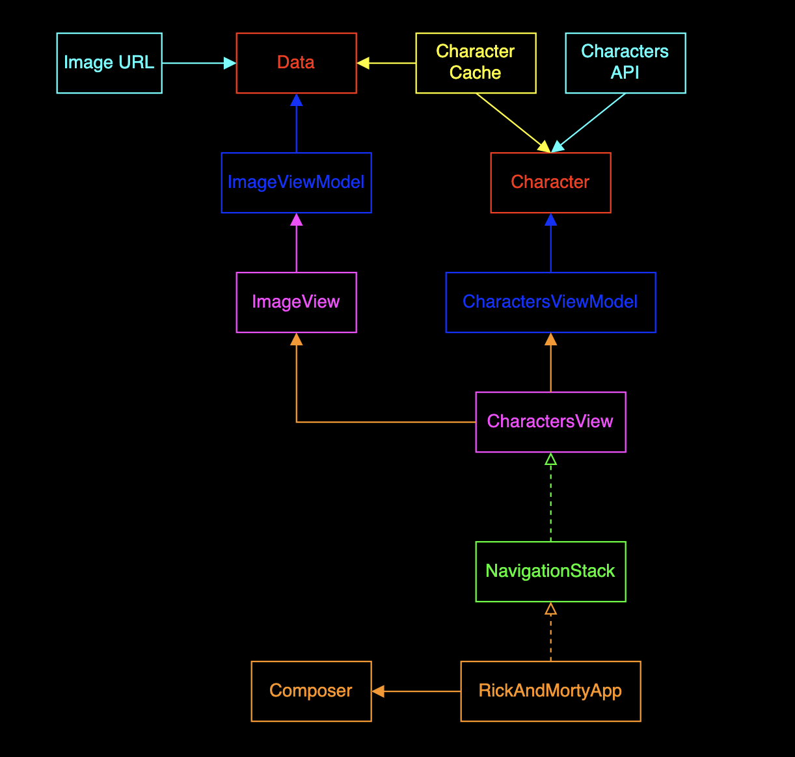

## App Architecture



---

## Characters Feature Specs

### Story: Customer requests to see characters of Rick and Morty

### Narrative #1

```
As an online customer
I want the app to show Rick and Morty characters
So I can visualize them
```

#### Scenarios (Acceptance criteria)

```
Given the customer has connectivity
  And the cache is empty
 When the customer requests to see the characters
 Then the app should display all characters from remote
  And save the characters to cache
  
Given the customer has connectivity
  And there's a cached version of the characters
 When the customer requests to see the characters
 Then the app should display all characters from cache
```

### Narrative #2

```
As an offline customer
I want the app to show Rick and Morty characters
So I can visualize them
```

#### Scenarios (Acceptance criteria)

```
Given the customer doesn't have connectivity
  And the cache is empty
 When the customer requests to see the characters
 Then the app should display an error message 
 
Given the customer doesn't have connectivity
  And there's a cached version of the characters
 When the customer requests to see the characters
 Then the app should display the characters from cache
```

---

## Image Feature Specs

### Story: Customer requests to see an image for every character

### Narrative #1

```
As an online customer
I want the app to show an image for every Rick and Morty character
So I can have a visual representation of the character
```

#### Scenarios (Acceptance criteria)

```
Given the customer has connectivity
  And the cache is empty
 When the customer requests to see a character's image
 Then the app should load the image with the given url of the character
  And save the image data to cache
  
Given the customer has connectivity
  And there's a cached version of the character's image
 When the customer requests to see the image
 Then the app should display the image from cache
```

### Narrative #2

```
As an offline customer
I want the app to show an image for every Rick and Morty character
So I can have a visual representation of the character
```

#### Scenarios (Acceptance criteria)

```
Given the customer doesn't have connectivity
  And the cache is empty
 When the customer requests to see the image
 Then the app should display a placeholder image
 
Given the customer doesn't have connectivity
  And there's a cached version of the character's image
 When the customer requests to see the image
 Then the app should display the image from cache
```
